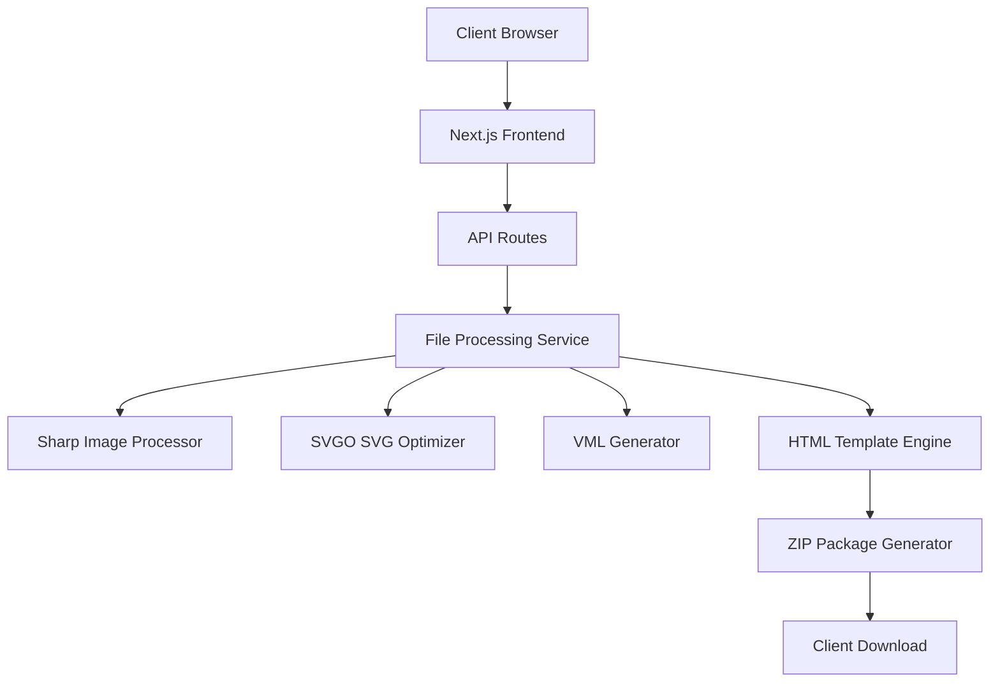

# Design Document

## Overview

CompatimageGen is a Next.js web application that processes logo files (SVG, PNG/JPEG, CSS) and generates universal email-compatible HTML code blocks. The system uses a client-server architecture where the frontend handles file upload and user interaction, while the backend processes files using Sharp for image manipulation, SVGO for SVG optimization, and custom logic for VML generation. The application outputs a ZIP package containing HTML snippets, fallback images, and integration instructions.

## Architecture

### High-Level Architecture



### Technology Stack

- **Frontend**: Next.js 15.4.2 with React 19.1.0, TypeScript, Tailwind CSS
- **Backend**: Next.js API Routes with Node.js runtime
- **Image Processing**: Sharp library for image manipulation and conversion
- **SVG Processing**: SVGO for SVG optimization and minification
- **File Handling**: JSZip for creating downloadable packages
- **Styling**: Tailwind CSS for responsive UI components

## Components and Interfaces

### Frontend Components

#### 1. FileUploadComponent
- **Purpose**: Handles drag-and-drop file upload with validation
- **Props**: `onFileUpload: (file: File) => void`, `acceptedTypes: string[]`
- **State**: `dragActive: boolean`, `uploadProgress: number`, `error: string | null`
- **Features**: Visual drag feedback, file type validation, progress indication

#### 2. ProcessingStatusComponent
- **Purpose**: Displays real-time processing status and progress
- **Props**: `status: ProcessingStatus`, `progress: number`, `warnings: Warning[]`
- **State**: `currentStep: string`, `isComplete: boolean`
- **Features**: Step-by-step progress, warning display, error handling

#### 3. PreviewComponent
- **Purpose**: Shows email client preview estimates
- **Props**: `previews: ClientPreview[]`, `htmlCode: string`
- **State**: `selectedClient: EmailClient`, `showCode: boolean`
- **Features**: Client-specific previews, HTML code display, copy functionality

#### 4. DownloadComponent
- **Purpose**: Manages ZIP package generation and download
- **Props**: `packageData: PackageData`, `onDownload: () => void`
- **State**: `isGenerating: boolean`, `downloadUrl: string | null`
- **Features**: ZIP generation status, automatic download trigger

### Backend Services

#### 1. FileProcessingService
```typescript
interface FileProcessingService {
  processFile(file: Buffer, type: FileType): Promise<ProcessingResult>
  validateFile(file: Buffer, type: FileType): ValidationResult
  optimizeFile(file: Buffer, type: FileType): Promise<OptimizedFile>
}
```

#### 2. FallbackGeneratorService
```typescript
interface FallbackGeneratorService {
  generatePngFallback(svg: string): Promise<Buffer>
  generateVmlCode(svg: string): Promise<string>
  generateBase64DataUri(buffer: Buffer, mimeType: string): string
}
```

#### 3. HTMLTemplateService
```typescript
interface HTMLTemplateService {
  generateEmailHtml(fallbacks: FallbackData): string
  createResponsiveWrapper(content: string): string
  addAccessibilityAttributes(html: string, altText: string): string
}
```

### API Endpoints

#### POST /api/upload
- **Purpose**: Handles file upload and initial validation
- **Input**: FormData with file
- **Output**: `{ fileId: string, validation: ValidationResult }`

#### POST /api/process
- **Purpose**: Processes uploaded file and generates fallbacks
- **Input**: `{ fileId: string, options: ProcessingOptions }`
- **Output**: `{ processId: string, status: ProcessingStatus }`

#### GET /api/status/:processId
- **Purpose**: Returns processing status and progress
- **Output**: `{ status: ProcessingStatus, progress: number, warnings: Warning[] }`

#### GET /api/download/:processId
- **Purpose**: Generates and serves ZIP package
- **Output**: ZIP file with HTML, PNG, and instructions

## Data Models

### Core Data Types

```typescript
interface ProcessingResult {
  originalFile: FileData
  optimizedSvg?: string
  pngFallback: Buffer
  vmlCode?: string
  base64DataUri: string
  htmlSnippet: string
  warnings: Warning[]
}

interface FallbackData {
  svgContent?: string
  pngBase64: string
  vmlCode?: string
  dimensions: { width: number; height: number }
  altText: string
}

interface ClientPreview {
  client: EmailClient
  fallbackUsed: FallbackType
  estimatedQuality: QualityRating
  previewImage?: Buffer
}

interface PackageData {
  htmlSnippet: string
  pngFile: Buffer
  instructions: string
  previews: ClientPreview[]
  metadata: ProcessingMetadata
}
```

### Email Client Configuration

```typescript
interface EmailClientConfig {
  name: string
  marketShare: number
  supportsSvg: boolean
  supportsVml: boolean
  cssLimitations: string[]
  preferredFallback: FallbackType
}

const EMAIL_CLIENTS: EmailClientConfig[] = [
  {
    name: 'Apple Mail',
    marketShare: 55,
    supportsSvg: true,
    supportsVml: false,
    cssLimitations: ['animations', 'filters'],
    preferredFallback: 'svg'
  },
  {
    name: 'Gmail',
    marketShare: 29,
    supportsSvg: false,
    supportsVml: false,
    cssLimitations: ['position', 'head-css'],
    preferredFallback: 'png'
  },
  {
    name: 'Outlook Desktop',
    marketShare: 6,
    supportsSvg: false,
    supportsVml: true,
    cssLimitations: ['border-radius', 'flexbox'],
    preferredFallback: 'vml'
  }
]
```

## Error Handling

### File Validation Errors
- **File Size**: Reject files > 1MB with specific error message
- **File Type**: Validate MIME types and file extensions
- **SVG Structure**: Parse and validate SVG syntax
- **Image Corruption**: Detect and handle corrupted image files

### Processing Errors
- **Sharp Failures**: Handle image processing errors with fallback options
- **SVGO Failures**: Graceful degradation when SVG optimization fails
- **VML Conversion**: Handle complex SVG elements that cannot convert to VML
- **Memory Limits**: Implement processing timeouts and memory management

### Client-Side Error Handling
```typescript
interface ErrorBoundary {
  handleFileUploadError(error: FileError): void
  handleProcessingError(error: ProcessingError): void
  handleNetworkError(error: NetworkError): void
  displayUserFriendlyMessage(error: Error): string
}
```

## Testing Strategy

### Unit Testing
- **File Processing**: Test SVG optimization, image compression, VML generation
- **HTML Generation**: Validate template output for different input types
- **Validation Logic**: Test file type detection and size validation
- **Fallback Generation**: Verify PNG and VML output quality

### Integration Testing
- **API Endpoints**: Test complete upload-to-download workflow
- **File Processing Pipeline**: End-to-end processing with various file types
- **ZIP Generation**: Validate package contents and structure
- **Error Scenarios**: Test error handling across the entire pipeline

### Email Client Testing
- **HTML Validation**: Test generated HTML in email client simulators
- **Fallback Verification**: Confirm correct fallback selection per client
- **Rendering Tests**: Visual regression testing for major email clients
- **Accessibility**: Test screen reader compatibility and alt text

### Performance Testing
- **File Processing Speed**: Benchmark processing times for different file sizes
- **Memory Usage**: Monitor memory consumption during image processing
- **Concurrent Users**: Test multiple simultaneous file processing requests
- **ZIP Generation**: Measure package creation and download performance

### Test Data Sets
- **SVG Samples**: Simple shapes, complex graphics, animations, gradients
- **Image Samples**: Various sizes, formats, compression levels
- **CSS Samples**: Simple styles, complex layouts, unsupported properties
- **Edge Cases**: Corrupted files, extremely large files, unusual formats

## Security Considerations

### File Upload Security
- **File Type Validation**: Strict MIME type and extension checking
- **Content Scanning**: Scan uploaded files for malicious content
- **Size Limits**: Enforce file size restrictions to prevent DoS
- **Temporary Storage**: Secure handling and cleanup of uploaded files

### Processing Security
- **SVG Sanitization**: Remove potentially dangerous SVG elements
- **Memory Management**: Prevent memory exhaustion attacks
- **Timeout Limits**: Implement processing timeouts to prevent hanging
- **Input Validation**: Sanitize all user inputs and file contents

## Performance Optimization

### Client-Side Optimization
- **Lazy Loading**: Load components and assets on demand
- **Code Splitting**: Split JavaScript bundles for faster initial load
- **Image Optimization**: Optimize UI images and icons
- **Caching**: Implement browser caching for static assets

### Server-Side Optimization
- **Processing Queue**: Implement job queue for file processing
- **Caching**: Cache processed results for identical files
- **Memory Management**: Efficient buffer handling and cleanup
- **Streaming**: Stream large file downloads to reduce memory usage