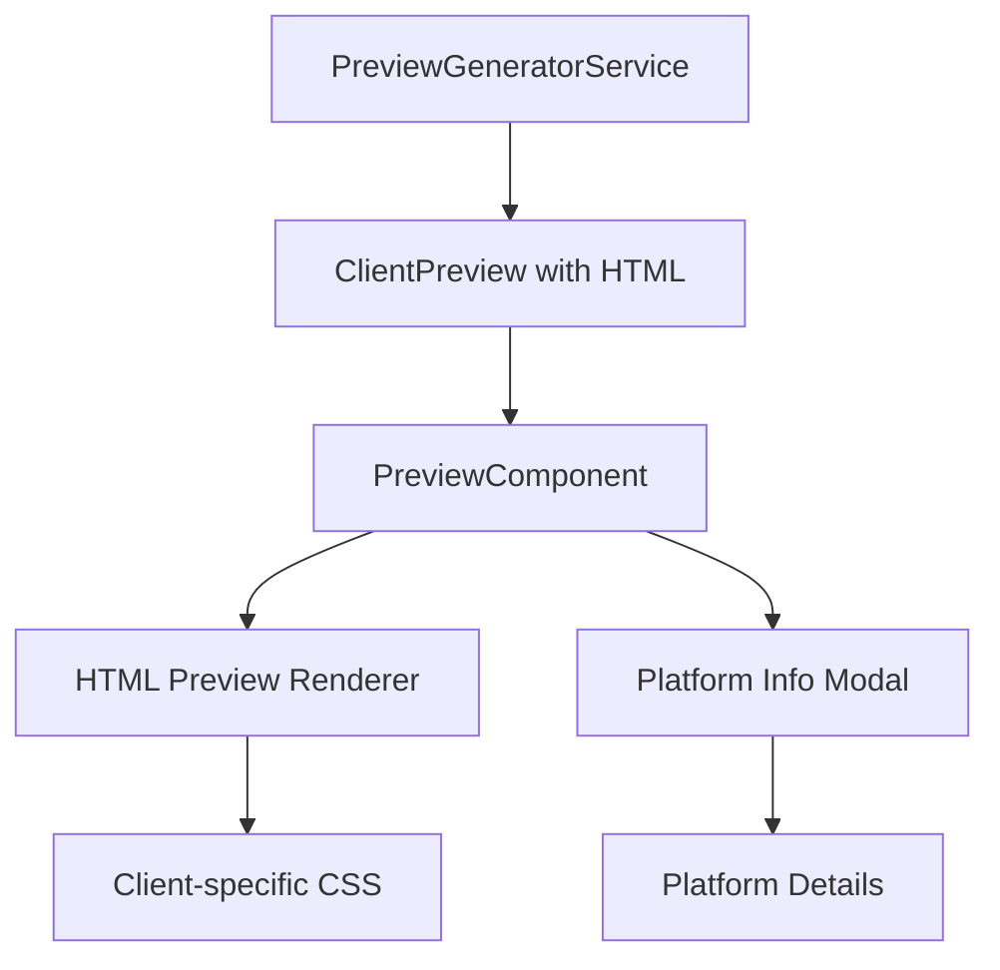

# Design Document

## Overview

The Email Preview Enhancement feature will transform the current text-based preview section into a more visual and informative experience. Users will see actual HTML previews of how their logo will render in different email clients, along with detailed information about each platform's capabilities and limitations accessible via an info icon. This enhancement will provide users with a clearer understanding of how their logo will appear across different email platforms.

## Architecture

The enhancement will build upon the existing preview functionality, extending the `PreviewComponent` and related services to support HTML rendering and detailed platform information. The architecture will maintain the current separation of concerns between data generation (backend) and presentation (frontend).

### Component Integration



## Components and Interfaces

### Enhanced Data Models

We'll extend the existing `ClientPreview` interface to include HTML preview content:

```typescript
interface ClientPreview {
  client: EmailClient;
  fallbackUsed: FallbackType;
  estimatedQuality: QualityRating;
  previewImage?: Buffer;
  // New fields
  htmlPreview: string;      // HTML content for rendering preview
  clientStyles: string;     // Client-specific CSS limitations
}

interface PlatformDetails {
  name: string;
  marketShare: number;
  supportedFeatures: string[];
  limitations: string[];
  bestPractices: string[];
  renderingNotes: string;
}
```

### Frontend Components

#### 1. Enhanced PreviewComponent

The existing `PreviewComponent` will be enhanced to support HTML previews and platform information:

```typescript
interface PreviewComponentProps {
  previews: ClientPreview[];
  htmlCode: string;
  platformDetails: Record<EmailClient, PlatformDetails>;
}
```

#### 2. HTMLPreviewRenderer

A new component to render HTML previews with client-specific limitations:

```typescript
interface HTMLPreviewRendererProps {
  htmlContent: string;
  clientStyles: string;
  clientId: EmailClient;
}
```

#### 3. PlatformInfoModal

A new component to display detailed platform information:

```typescript
interface PlatformInfoModalProps {
  isOpen: boolean;
  onClose: () => void;
  platformDetails: PlatformDetails;
  preview: ClientPreview;
}
```

### Backend Services

#### 1. Enhanced PreviewGeneratorService

The existing `PreviewGeneratorService` will be extended to generate HTML previews:

```typescript
class PreviewGeneratorService {
  // Existing methods
  static async generateClientPreviews(result: ProcessingResult): Promise<ClientPreview[]>;
  
  // New methods
  static generateHtmlPreview(fallbackType: FallbackType, result: ProcessingResult, clientId: EmailClient): string;
  static generateClientSpecificStyles(clientId: EmailClient): string;
}
```

#### 2. PlatformDetailsService

A new service to provide detailed information about email platforms:

```typescript
class PlatformDetailsService {
  static getPlatformDetails(clientId: EmailClient): PlatformDetails;
  static getPlatformRenderingNotes(clientId: EmailClient, fallbackType: FallbackType): string;
}
```

## Detailed Design

### HTML Preview Generation

To generate accurate HTML previews, we'll:

1. Use the existing `HTMLTemplateService` to generate the base HTML
2. Apply client-specific CSS limitations based on the email client
3. Render the HTML within an isolated container (iframe or sandboxed div)
4. Apply appropriate styling to simulate the email client's environment

```typescript
// Example implementation
static generateHtmlPreview(fallbackType: FallbackType, result: ProcessingResult, clientId: EmailClient): string {
  const { svgContent, pngBase64, vmlCode, dimensions, altText } = extractFallbackData(result);
  
  // Select appropriate fallback based on client and fallback type
  let content = '';
  if (fallbackType === 'svg' && svgContent) {
    content = wrapSvgForEmailClients(svgContent, dimensions.width, dimensions.height, altText);
  } else if (fallbackType === 'vml' && vmlCode) {
    content = vmlCode;
  } else {
    content = createPngFallback(pngBase64, dimensions.width, dimensions.height, altText);
  }
  
  // Apply client-specific wrapper
  return createClientSpecificWrapper(content, clientId, dimensions);
}
```

### Platform Information Modal

The platform information modal will display:

1. Platform name and market share
2. Supported features and limitations
3. Best practices for the platform
4. Specific notes about how the logo will render
5. Visual examples of common issues

The modal will be implemented as a responsive overlay that can be easily dismissed.

### Client-Specific CSS Simulation

To accurately represent how each email client renders content, we'll apply client-specific CSS limitations:

```typescript
// Example implementation
static generateClientSpecificStyles(clientId: EmailClient): string {
  switch (clientId) {
    case 'outlook-desktop':
      return `
        /* Outlook Desktop limitations */
        .email-preview {
          font-family: 'Calibri', sans-serif;
          background-color: #f9f9f9;
        }
        /* Disable unsupported CSS */
        .email-preview * {
          border-radius: 0 !important;
          box-shadow: none !important;
          text-shadow: none !important;
        }
      `;
    case 'gmail':
      return `
        /* Gmail limitations */
        .email-preview {
          font-family: 'Arial', sans-serif;
          background-color: #ffffff;
        }
        /* Gmail strips head CSS */
        .email-preview style, .email-preview link {
          display: none !important;
        }
      `;
    // Other clients...
    default:
      return '';
  }
}
```

## User Interface Design

### Preview Cards with HTML Rendering

Each preview card will be enhanced to show:

1. The actual HTML rendering of the logo
2. An info icon in the top-right corner
3. The existing fallback and quality information

```
┌─────────────────────────────────────┐
│ Client Name               [ℹ️ Info] │
├─────────────────────────────────────┤
│                                     │
│         [HTML Preview Area]         │
│                                     │
├─────────────────────────────────────┤
│ Fallback: SVG (Vector)              │
│ Quality: Excellent                  │
│                                     │
│ Notes:                              │
│ • Vector format will render at...   │
└─────────────────────────────────────┘
```

### Platform Information Modal

The platform information modal will appear when the info icon is clicked:

```
┌─────────────────────────────────────────────┐
│ Platform Details                       [✕] │
├─────────────────────────────────────────────┤
│ Gmail                                       │
│ Market Share: 29%                          │
│                                             │
│ Supported Features:                         │
│ • Basic HTML                                │
│ • Inline CSS                                │
│ • Images with alt text                      │
│                                             │
│ Limitations:                                │
│ • No support for SVG                        │
│ • Limited CSS positioning                   │
│ • No external stylesheets                   │
│                                             │
│ Best Practices:                             │
│ • Use inline CSS                            │
│ • Keep table-based layouts simple           │
│ • Provide fallback images                   │
│                                             │
│ Rendering Notes:                            │
│ Your logo will use PNG fallback in Gmail    │
│ with good quality rendering.                │
└─────────────────────────────────────────────┘
```

## Performance Considerations

1. **Lazy Rendering**: Only render HTML previews for visible cards to reduce initial load time
2. **Caching**: Cache platform details to avoid redundant data fetching
3. **Optimized Modal**: Ensure the platform info modal loads quickly and doesn't block the main thread

## Accessibility Considerations

1. **Keyboard Navigation**: Ensure all interactive elements are keyboard accessible
2. **Screen Reader Support**: Add appropriate ARIA labels to the info icon and modal
3. **Focus Management**: Properly manage focus when opening and closing the modal
4. **Color Contrast**: Ensure sufficient contrast for text and icons

## Testing Strategy

1. **Unit Tests**:
   - Test HTML preview generation for different clients
   - Test platform details retrieval
   - Test client-specific CSS generation

2. **Component Tests**:
   - Test PreviewComponent with HTML previews
   - Test PlatformInfoModal interactions
   - Test responsive behavior

3. **Integration Tests**:
   - Test the complete preview workflow with different file types
   - Test platform info modal integration with previews

4. **Accessibility Tests**:
   - Test keyboard navigation
   - Test screen reader compatibility
   - Test focus management